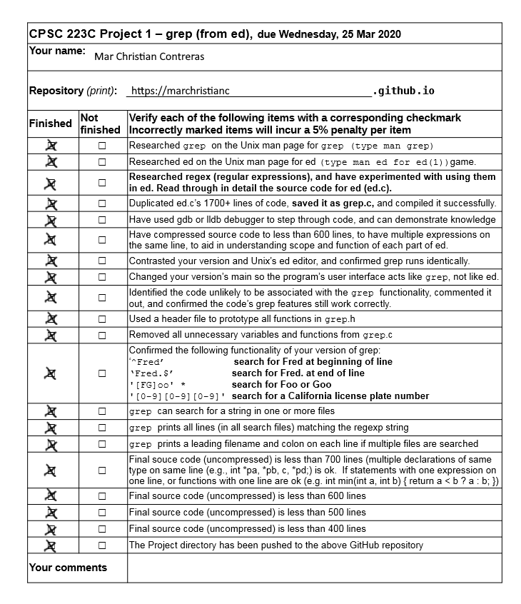

<!DOCTYPE HTML>
<!--
	Dimension by HTML5 UP
	html5up.net | @ajlkn
	Free for personal and commercial use under the CCA 3.0 license (html5up.net/license)
-->
<html>
	<head>
		<title>My Portfolio</title>
		<meta charset="utf-8" />
		<meta name="viewport" content="width=device-width, initial-scale=1, user-scalable=no" />
		<link rel="stylesheet" href="assets/css/main.css" />
		<noscript><link rel="stylesheet" href="assets/css/noscript.css" /></noscript>
	</head>
	<body class="is-preload">

		<!-- Wrapper -->
			

				<!-- Header -->
					<header id="header">
						

							
						

						

							

								<h1>My Portfolio</h1>
								
My name is Mar Christian Contreras. I am a student currently attending CSUF. This is my
									website that holds all of my coding projects.
								

							

						

						<nav>
							<ul>
								<li><a href="#project1">Project 1</a></li>
								<li><a href="#midterm">Midterm</a></li>
								<li><a href="#about">Project 3</a></li>
								<li><a href="#contact">Contact</a></li>
								<!--<li><a href="#elements">Elements</a></li>-->
							</ul>
						</nav>
					</header>

				<!-- Main -->
					

						<!-- Intro -->
							<article id="project1">
								<h2 class="major">GREP from ed</h2>
								<!-- -->
								
Link to this github project can be located <a href="https://github.com/marchristianc/GREP">here</a>.

								
This project is the compression of the GREP program into less than 400 lines of code. It first involved having to read
								and understand the code in order to be able to strip and condense the code.

								
								
<b>Usage</b>: grep 'text' file.txt

							</article>

						<!-- Work -->
							<article id="midterm">
								<h2 class="major">Midterm Submission</h2>
								<!---->
								<pre><code>
// Midterm exam – The C Programming Language, Spring 2020      
// (Coding section – 52 points)
// (8 pts)  
// (1)  Find any and all mistakes in the following code, and correct them.  
void count() {   
    printf("Enter lines of text here: ...\n");   
    int c, nl = 0, nc = 0, nt = 0, nbackslash = 0;  
    while ((c = fgetc(stdin)) != EOF) {   
        if (c == '\n') { ++nl; } else 
        if (c == '\t') { ++nt; } else 
        if (c == '\\') { ++nbackslash; } else 
        if (isalpha(c)) { ++nc; }   
    } 
    printf("lines: %d\n", nl);   
    printf("tabs: %d\n", nt);   
    printf("backslashes: %d\n", nbackslash);   
    printf("alphanumeric: %d\n", nc); 
}

int main(int argc, const char* argv[]) { 
    count();   
    return 0; 
} 
// The C Standard Library:  Identify the standard library functions that do the following…
// (3 pts)  (2) Find the first character c in a const char* s: ____________________________ 
    strchr(s, c);
// (3 pts)  (3) Find the length of the prefix of const char* s that has characters in const char* t: ____________________ 
    strspn(s, t);
// (3 pts)  (4) Terminate a program immediately _________________________________ 
    exit(0);
// (3 pts)  (5) Open the file “midterm.txt” in read mode ___________________________
    FILE* file;
    file = fopen("midterm.txt", "r");
    if (file == NULL)
        printf("Error opening file\n");
// Using pointers, implement each of the following C standard library functions  size_t strcpy(char* s, const char* t);     
    char* strcpy(char* s, const char* t) {
        char* p = s;
        while ((*s++ = *t++) != '\0');
        return p;
    }             
// (4 pts)  (6) 
// char* strncat(char* s, const char* t, size_t n);   
    char* strncat(char* s, const char* t, size_t n) {
        char* p = s;
        while (*s != '\0') { ++s; }
        while (n-- > 0 && *t != '\0') {
            *s++ = *t++;
        }
        *s = '\0';
        return p;
    }
// (4 pts)  (7) 
// int strcmp(const char* s, const char* t);       
    int strcmp(const char* s, const char* t) {
        while (*s != '\0' && *t != '\0' && *s == *t) {
            ++s;
            ++t;
        }
        return *s - *t;
    }
// (4 pts)   (8)
// PART III: SHORT PROGRAM (20 pts)   (9) Fill in the program code below for the square ADT (abstract data type) 
//------ POINT ---------------------------------------------------------------- 
typedef struct point point; 
struct point { double x, y; }; 
//------ SQUARE ----------------------------------------------------------------- 
typedef struct square square; 
struct square { point ul;  size_t side;  }; 
square* square_init(double ulx, double uly, double side){
    square* sq = (square*)malloc(sizeof(square));
    point* ul = (point*)malloc(sizeof(point));
    
    ul->x = ulx;
    ul->y = uly;
    
    sq->ul = ul;
    sq->side = side;
    return sq;
}
// TODO 
void square_delete(square* sq){
    free(sq);
}                  
// TODO 
void square_move(square* sq, double x, double y){
    (sq->ul)->x = x;
    (sq->ul)->y = y;
}
// TODO 
void square_expandby(square* sq, double expandby){
    sq->side *= expandby;
}
// TODO 
double square_area(square* sq){
    return (sq->side)*(sq->side);
}                  
// TODO
double square_perimeter(square* r){
    return (r->side)*4;
}              
// TODO
// print location, side, area and perimeter 
void square_print(const char* msg, square* sq){
    printf("Position (%d, %d)\n", (sq->ul)->x, (sq->ul)->y);
    printf("Side length (%d)\n", (sq->side));
    printf("Area (%d)\n", square_area(sq));
    printf("Perimeter (%d)\n", square_perimeter(sq));
}  
// TODO 
void test_square(double ulx, double uly, double side) {  
    square* sq = square_init(ulx, uly, side);  
    square_print(“sq is: “, sq);  
    square_move(2, 2);  
    square_print(“sq is now: “, sq);  
    square_expandby(sq, 10);  
    square_print(“sq has expanded to: “, sq);  
    square_delete(sq);  printf(“\n\n”);
}  
void tests_square() {  
    test_square(0, 0, 10); 
    test_square(1, 1, 5);  
}    
// TODO (optional)
int main(int argc, const char* argv[]) {  
    tests_square();  
    return 0; 
}

								</code></pre>
							</article>

						<!-- About -->
							<article id="about">
								<h2 class="major">About</h2>
								
								
Lorem ipsum dolor sit amet, consectetur et adipiscing elit. Praesent eleifend dignissim arcu, at eleifend sapien imperdiet ac. Aliquam erat volutpat. Praesent urna nisi, fringila lorem et vehicula lacinia quam. Integer sollicitudin mauris nec lorem luctus ultrices. Aliquam libero et malesuada fames ac ante ipsum primis in faucibus. Cras viverra ligula sit amet ex mollis mattis lorem ipsum dolor sit amet.

							</article>

						<!-- Contact -->
							<article id="contact">
								<h2 class="major">Contact</h2>
								<form method="post" action="#">
									

										

											<label for="name">Name</label>
											<input type="text" name="name" id="name" />
										

										

											<label for="email">Email</label>
											<input type="text" name="email" id="email" />
										

										

											<label for="message">Message</label>
											<textarea name="message" id="message" rows="4"></textarea>
										

									

									<ul class="actions">
										<li><input type="submit" value="Send Message" class="primary" /></li>
										<li><input type="reset" value="Reset" /></li>
									</ul>
								</form>
								<ul class="icons">
									<li><a href="#" class="icon brands fa-twitter">Twitter</a></li>
									<li><a href="#" class="icon brands fa-facebook-f">Facebook</a></li>
									<li><a href="#" class="icon brands fa-instagram">Instagram</a></li>
									<li><a href="#" class="icon brands fa-github">GitHub</a></li>
								</ul>
							</article>

						<!-- Elements -->
							<article id="elements">
								<h2 class="major">Elements</h2>

								<section>
									<h3 class="major">Text</h3>
									
This is <b>bold</b> and this is <strong>strong</strong>. This is <i>italic</i> and this is <em>emphasized</em>.
									This is superscript text and this is subscript text.
									This is <u>underlined</u> and this is code: <code>for (;;) { ... }</code>. Finally, <a href="#">this is a link</a>.

									

									<h2>Heading Level 2</h2>
									<h3>Heading Level 3</h3>
									<h4>Heading Level 4</h4>
									<h5>Heading Level 5</h5>
									<h6>Heading Level 6</h6>
									

									<h4>Blockquote</h4>
									<blockquote>Fringilla nisl. Donec accumsan interdum nisi, quis tincidunt felis sagittis eget tempus euismod. Vestibulum ante ipsum primis in faucibus vestibulum. Blandit adipiscing eu felis iaculis volutpat ac adipiscing accumsan faucibus. Vestibulum ante ipsum primis in faucibus lorem ipsum dolor sit amet nullam adipiscing eu felis.</blockquote>
									<h4>Preformatted</h4>
									<pre><code>i = 0;

while (!deck.isInOrder()) {
    print 'Iteration ' + i;
    deck.shuffle();
    i++;
}

print 'It took ' + i + ' iterations to sort the deck.';</code></pre>
								</section>

								<section>
									<h3 class="major">Lists</h3>

									<h4>Unordered</h4>
									<ul>
										<li>Dolor pulvinar etiam.</li>
										<li>Sagittis adipiscing.</li>
										<li>Felis enim feugiat.</li>
									</ul>

									<h4>Alternate</h4>
									<ul class="alt">
										<li>Dolor pulvinar etiam.</li>
										<li>Sagittis adipiscing.</li>
										<li>Felis enim feugiat.</li>
									</ul>

									<h4>Ordered</h4>
									<ol>
										<li>Dolor pulvinar etiam.</li>
										<li>Etiam vel felis viverra.</li>
										<li>Felis enim feugiat.</li>
										<li>Dolor pulvinar etiam.</li>
										<li>Etiam vel felis lorem.</li>
										<li>Felis enim et feugiat.</li>
									</ol>
									<h4>Icons</h4>
									<ul class="icons">
										<li><a href="#" class="icon brands fa-twitter">Twitter</a></li>
										<li><a href="#" class="icon brands fa-facebook-f">Facebook</a></li>
										<li><a href="#" class="icon brands fa-instagram">Instagram</a></li>
										<li><a href="#" class="icon brands fa-github">Github</a></li>
									</ul>

									<h4>Actions</h4>
									<ul class="actions">
										<li><a href="#" class="button primary">Default</a></li>
										<li><a href="#" class="button">Default</a></li>
									</ul>
									<ul class="actions stacked">
										<li><a href="#" class="button primary">Default</a></li>
										<li><a href="#" class="button">Default</a></li>
									</ul>
								</section>

								<section>
									<h3 class="major">Table</h3>
									<h4>Default</h4>
									

										<table>
											<thead>
												<tr>
													<th>Name</th>
													<th>Description</th>
													<th>Price</th>
												</tr>
											</thead>
											<tbody>
												<tr>
													<td>Item One</td>
													<td>Ante turpis integer aliquet porttitor.</td>
													<td>29.99</td>
												</tr>
												<tr>
													<td>Item Two</td>
													<td>Vis ac commodo adipiscing arcu aliquet.</td>
													<td>19.99</td>
												</tr>
												<tr>
													<td>Item Three</td>
													<td> Morbi faucibus arcu accumsan lorem.</td>
													<td>29.99</td>
												</tr>
												<tr>
													<td>Item Four</td>
													<td>Vitae integer tempus condimentum.</td>
													<td>19.99</td>
												</tr>
												<tr>
													<td>Item Five</td>
													<td>Ante turpis integer aliquet porttitor.</td>
													<td>29.99</td>
												</tr>
											</tbody>
											<tfoot>
												<tr>
													<td colspan="2"></td>
													<td>100.00</td>
												</tr>
											</tfoot>
										</table>
									

									<h4>Alternate</h4>
									

										<table class="alt">
											<thead>
												<tr>
													<th>Name</th>
													<th>Description</th>
													<th>Price</th>
												</tr>
											</thead>
											<tbody>
												<tr>
													<td>Item One</td>
													<td>Ante turpis integer aliquet porttitor.</td>
													<td>29.99</td>
												</tr>
												<tr>
													<td>Item Two</td>
													<td>Vis ac commodo adipiscing arcu aliquet.</td>
													<td>19.99</td>
												</tr>
												<tr>
													<td>Item Three</td>
													<td> Morbi faucibus arcu accumsan lorem.</td>
													<td>29.99</td>
												</tr>
												<tr>
													<td>Item Four</td>
													<td>Vitae integer tempus condimentum.</td>
													<td>19.99</td>
												</tr>
												<tr>
													<td>Item Five</td>
													<td>Ante turpis integer aliquet porttitor.</td>
													<td>29.99</td>
												</tr>
											</tbody>
											<tfoot>
												<tr>
													<td colspan="2"></td>
													<td>100.00</td>
												</tr>
											</tfoot>
										</table>
									

								</section>

								<section>
									<h3 class="major">Buttons</h3>
									<ul class="actions">
										<li><a href="#" class="button primary">Primary</a></li>
										<li><a href="#" class="button">Default</a></li>
									</ul>
									<ul class="actions">
										<li><a href="#" class="button">Default</a></li>
										<li><a href="#" class="button small">Small</a></li>
									</ul>
									<ul class="actions">
										<li><a href="#" class="button primary icon solid fa-download">Icon</a></li>
										<li><a href="#" class="button icon solid fa-download">Icon</a></li>
									</ul>
									<ul class="actions">
										<li>Disabled</li>
										<li>Disabled</li>
									</ul>
								</section>

								<section>
									<h3 class="major">Form</h3>
									<form method="post" action="#">
										

											

												<label for="demo-name">Name</label>
												<input type="text" name="demo-name" id="demo-name" value="" placeholder="Jane Doe" />
											

											

												<label for="demo-email">Email</label>
												<input type="email" name="demo-email" id="demo-email" value="" placeholder="jane@untitled.tld" />
											

											

												<label for="demo-category">Category</label>
												<select name="demo-category" id="demo-category">
													<option value="">-</option>
													<option value="1">Manufacturing</option>
													<option value="1">Shipping</option>
													<option value="1">Administration</option>
													<option value="1">Human Resources</option>
												</select>
											

											

												<input type="radio" id="demo-priority-low" name="demo-priority" checked>
												<label for="demo-priority-low">Low</label>
											

											

												<input type="radio" id="demo-priority-high" name="demo-priority">
												<label for="demo-priority-high">High</label>
											

											

												<input type="checkbox" id="demo-copy" name="demo-copy">
												<label for="demo-copy">Email me a copy</label>
											

											

												<input type="checkbox" id="demo-human" name="demo-human" checked>
												<label for="demo-human">Not a robot</label>
											

											

												<label for="demo-message">Message</label>
												<textarea name="demo-message" id="demo-message" placeholder="Enter your message" rows="6"></textarea>
											

										

										<ul class="actions">
											<li><input type="submit" value="Send Message" class="primary" /></li>
											<li><input type="reset" value="Reset" /></li>
										</ul>
									</form>
								</section>

							</article>

					

				<!-- Footer -->
					<footer id="footer">
						
&copy; Mar Christian Contreras. Design: <a href="https://html5up.net">HTML5 UP</a>.

					</footer>

			

		<!-- BG -->
			

		<!-- Scripts -->
			
			
			
			
			

	</body>
</html>
